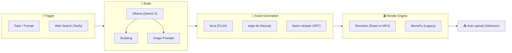

# Auto-reel: From Idea to Final Video Without Touching an Editor

Creating vertical content (Reels, TikToks, Shorts) is one of the most repetitive and time-consuming tasks. **Auto-reel** is a comprehensive platform designed to automate this entire process, from initial research to final publishing, using a modern microservices architecture and code-based rendering engines.

## 1. The Problem: The Content Bottleneck
Generating high-quality video requires: scripting, voiceover, image/clip searching, subtitling, and rendering. Doing this manually for 5-10 videos a day is unsustainable for a single creator. Existing solutions are often expensive or limited in customization.

## 2. The Solution: A Programmable Content Factory
Auto-reel extends the original engine of [MoneyPrinterV2](https://github.com/FujiwaraChoki/MoneyPrinterV2) by adding a visual management layer and a much more powerful React-based rendering engine.

### Distributed Architecture
Unlike simple CLI scripts, Auto-reel operates as a distributed system:
*   **FastAPI Backend:** Manages job states, social media accounts, and costs.
*   **React Dashboard:** A premium interface for real-time pipeline monitoring via WebSockets.
*   **Remotion Renderer:** A Node.js microservice that renders videos using React and Chromium, allowing for complex animations that would be impossible with traditional video tools.
*   **Celery Workers:** Process heavy tasks (Whisper transcription, image generation) in the background without blocking the UI.

### The 9-Step Pipeline
The system executes a coordinated sequence:
1.  **Search:** Fetches fresh data from the web to ensure the script is current.
2.  **Scripting:** Uses local **Ollama** to generate technical or viral scripts.
3.  **Visuals:** Generates unique images with **fal.ai (FLUX)** for a fraction of a cent.
4.  **Voice:** Synthesizes natural audio with Microsoft Neural voices.
5.  **Subtitles:** Uses **faster-whisper** for word-level timing (TikTok style).
6.  **Rendering:** Composes everything into a dynamic timeline in **Remotion**.
7.  **Publishing:** Automates YouTube uploads using pre-authenticated Firefox profiles, avoiding bot blocks.

## 3. Infrastructure and Costs
The project is designed to be **self-hosted**. The only external costs are image generation (approx. $0.003 per image) and optional web search. All language processing and transcription happen on your own hardware using Ollama and local models.

## Conclusion
Auto-reel is an example of how AI orchestration and code-based rendering can transform a creative industry. By removing the friction of "doing," we allow the creator to focus solely on the "what."

---

*This project is part of my focus on intelligent workflow automation and integrating AI into real production processes.*
