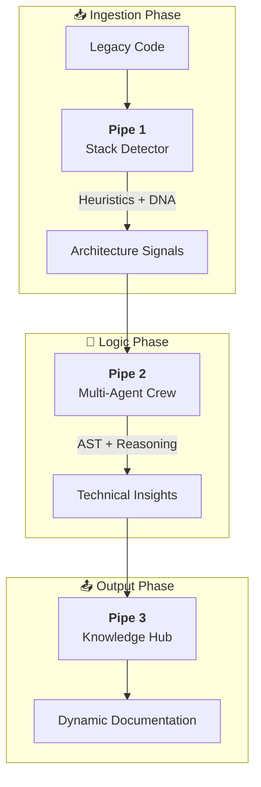

# CodeReborn Engine: Systemic Intelligence Over Legacy Chaos

Modern software development often faces the "Legacy Debt" wall. CodeReborn Engine was designed not just as a tool, but as a specialized factory for technical understanding. By combining high-performance parsing with autonomous AI agents, we transform opaque source code into a map of strategic knowledge.

## 1. Hybrid Ingestion: The Power of Tree-sitter

AI is only as good as the context it receives. Instead of sending raw, unstructured files to an LLM, CodeReborn uses **Tree-sitter** to perform incremental parsing. This allows us to:
- Identify precise technical stacks via "Architecture DNA".
- Map function calls and dependencies before the AI even sees the code.
- Reduce token noise by selecting only relevant syntax branches.

## 2. Multi-Agent Orchestration with CrewAI

Once the code is parsed, the **CrewAI** orchestrator takes over. We don't use a single "God Model"; we deploy a crew of specialized agents:
- **The Architect:** Analyzes design patterns and structural flaws.
- **The Security Specialist:** Searches for vulnerabilities and bad practices.
- **The Documenter:** Translates technical logic into human-readable business value.

## 3. Observability and Lifecycle

Building with LLMs requires extreme precision. We integrated **Langfuse** for tracing every agent decision and **LiteLLM** to maintain a unified interface across 100+ different models. This ensures that the engine is model-agnostic and budget-conscious.

## Conclusion

CodeReborn is an example of how AI can be a force multiplier for technical debt management. It’s not about replacing developers, but about giving them a "superpower" to understand in minutes what used to take weeks of manual exploration.
