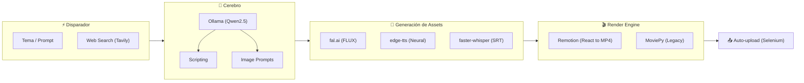

# Auto-reel: De la Idea al Video Final sin Tocar un Editor

La creación de contenido en formato vertical (Reels, TikToks, Shorts) es una de las tareas más repetitivas y que más tiempo consumen. **Auto-reel** es una plataforma integral diseñada para automatizar todo este proceso, desde la investigación inicial hasta la publicación final, utilizando una arquitectura moderna de microservicios y motores de renderizado basados en código.

## 1. El Problema: El Cuello de Botella del Contenido
Generar un video de alta calidad requiere: guion, locución, búsqueda de imágenes/clips, subtitulado y renderizado. Hacer esto manualmente para 5-10 videos al día es insostenible para un solo creador. Las soluciones existentes suelen ser caras o limitadas en personalización.

## 2. La Solución: Una Factoría de Contenido Programable
Auto-reel extiende el motor original de [MoneyPrinterV2](https://github.com/FujiwaraChoki/MoneyPrinterV2) añadiendo una capa de gestión visual y un motor de renderizado mucho más potente basado en React.

### Arquitectura Distribuida
A diferencia de simples scripts de CLI, Auto-reel opera como un sistema distribuido:
*   **FastAPI Backend:** Gestiona el estado de los trabajos, las cuentas de redes sociales y los costos.
*   **React Dashboard:** Una interfaz premium para monitorear el pipeline en tiempo real mediante WebSockets.
*   **Remotion Renderer:** Un microservicio en Node.js que renderiza videos usando React y Chromium, permitiendo animaciones complejas que serían imposibles con herramientas de video tradicionales.
*   **Celery Workers:** Procesan las tareas pesadas (transcripción con Whisper, generación de imágenes) en segundo plano sin bloquear la UI.

### El Pipeline de 9 Pasos
El sistema ejecuta una secuencia coordinada:
1.  **Búsqueda:** Obtiene datos frescos de la web para asegurar que el guion sea actual.
2.  **Guionización:** Usa **Ollama** localmente para generar guiones técnicos o virales.
3.  **Visuales:** Genera imágenes únicas con **fal.ai (FLUX)** por una fracción de centavo.
4.  **Voz:** Sintetiza audio natural con voces neurales de Microsoft.
5.  **Subtítulos:** Usa **faster-whisper** para obtener tiempos exactos palabra por palabra (estilo TikTok).
6.  **Renderizado:** Compone todo en una línea de tiempo dinámica en **Remotion**.
7.  **Publicación:** Automatiza la subida a YouTube mediante perfiles de Firefox pre-autenticados, evitando bloqueos de bots.

## 3. Infraestructura y Costos
El proyecto está diseñado para ser **auto-hospedado**. Los únicos costos externos son la generación de imágenes (aprox. $0.003 por imagen) y la búsqueda web opcional. Todo el procesamiento de lenguaje y transcripción ocurre en tu propio hardware usando Ollama y modelos locales.

## Conclusión
Auto-reel es un ejemplo de cómo la orquestación de IA y el renderizado basado en código pueden transformar una industria creativa. Al eliminar la fricción del "hacer", permitimos que el creador se enfoque únicamente en el "qué".

---

*Este proyecto es parte de mi enfoque en la automatización de flujos de trabajo inteligentes y la integración de IA en procesos de producción real.*
