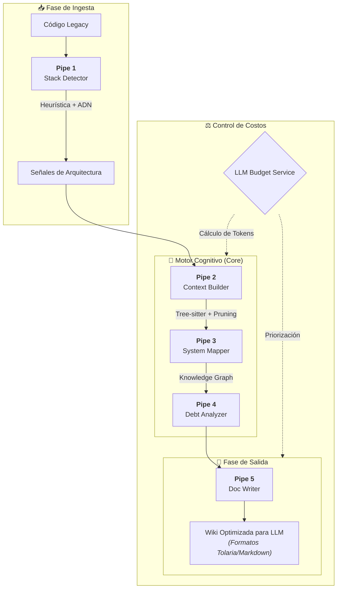

# CodeReborn Engine: Inteligencia Sistémica sobre el Caos Legacy

La deuda técnica no es solo código mal escrito; es la pérdida de contexto sobre cómo los sistemas se comunican y evolucionan. **CodeReborn Engine** nace con un objetivo claro: ayudar a las empresas atrapadas en sistemas legacy a recuperar el control de su software, generando una **Wiki técnica viva** y una documentación profunda de aquello que ningún programador quiere (o sabe) tocar.

## El Problema: El "Agujero Negro" del Legacy
En el mundo corporativo, los sistemas legacy son cajas negras. La falta de documentación y la rotación de personal hacen que tocar el código sea un riesgo inaceptable. Los desarrolladores evitan estos proyectos porque el 80% del tiempo se gasta intentando entender qué hace el sistema en lugar de innovar.

## La Solución: Un Ecosistema de Tuberías Dirigidas
A diferencia de los asistentes de código genéricos, CodeReborn utiliza un **Grafo de Tareas Multi-Agente (CrewAI)** que separa la extracción de datos del razonamiento cognitivo. El sistema opera bajo la **"Regla Cero"**: nunca usar un LLM para una tarea que pueda resolverse de forma determinista.

### El Pipeline de Inteligencia: De la Heurística al Razonamiento

1.  **Pipe 1: Stack Detector (DNA Analysis):** No solo detecta extensiones. Utiliza una **Heurística de ADN** para identificar monorepos, realizar inducción manual de frameworks (como Flutter mediante `pubspec.yaml`) y garantizar la **preservación del 100% de señales desconocidas** (UnknownSignals) para su análisis posterior.
2.  **Pipe 2: Universal Signal Extractor (Layer 1):** Utiliza **Tree-sitter** para realizar un análisis de AST (Abstract Syntax Tree) agnóstico al lenguaje. Esto permite mapear clases, interfaces, decoradores y dependencias internas sin ejecutar el código, detectando incluso si un proyecto es Backend, Frontend o Mobile mediante **Inferencia de Scope Adaptativa**.
3.  **Pipe 3: Architecture Context Builder:** No enviamos todo el código a la IA. Este componente realiza una poda heurística basada en grafos de importación, creando un mapa jerárquico comprimido que maximiza la utilidad de la ventana de contexto del LLM.
4.  **Pipe 4: System Mapper (Cognitive Core):** El cerebro que interpreta patrones en "arquitecturas mixtas" (sistemas mitad limpios, mitad legacy) y define las fronteras que alimentarán al resto del sistema.
5.  **Pipe 5: Doc Writing Layer (Multi-Pool):** Un equipo de agentes en paralelo que generan una **Wiki técnica viva**, guías de arquitectura y especificaciones JSON para consumo de otras IAs.

## Infraestructura y Observabilidad
Construir con IA a escala requiere rigor operativo. CodeReborn integra:
*   **LLM Budget Service:** Un gatekeeper que autoriza cada llamada a la IA basándose en el presupuesto y la complejidad de la tarea.
*   **Clean Architecture + DDD:** Garantizando que el motor sea agnóstico a la infraestructura (FastAPI, Redis, PostgreSQL).
*   **Observabilidad Total:** Monitoreo de trazas y costos en tiempo real mediante **Langfuse** y **LiteLLM**.

## Estado Actual
**Proyecto en Pausa (On Hold).**
El desarrollo de CodeReborn Engine se encuentra detenido por una decisión estratégica de arquitectura. En un ecosistema de IA que evoluciona diariamente con herramientas altamente especializadas (como [Tolaria](https://github.com/refactoringhq/tolaria)), he decidido pausar la ejecución para profundizar en la fase de concepción. Si bien la visión de CodeReborn es plenamente válida, mi objetivo actual es estudiar las herramientas emergentes para evitar la **sobre-ingeniería** y asegurar que la nueva composición del proyecto sea lo más ágil y potente posible, integrándose con ecosistemas modernos de gestión de conocimiento.

---

*CodeReborn Engine no es solo una herramienta; es la infraestructura necesaria para que la IA entienda realmente cómo funciona el software del mundo real.*
